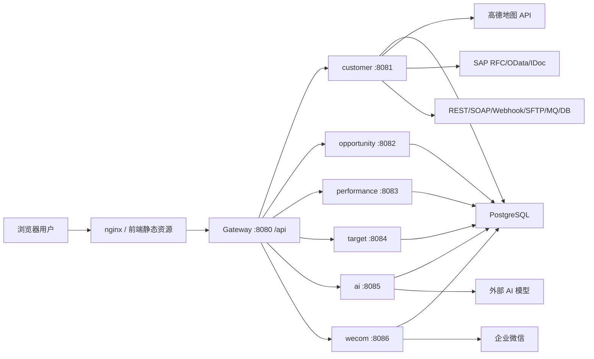

# 华孚时尚 CRM 项目说明、架构规范与优化路线

> 维护基线：`huafu-crm-suite`
>
> 本文档用于统一后续开发认知。所有新需求、修复、重构、部署脚本和说明文档，默认都应在 `huafu-crm-suite` 内完成；历史目录 `huafu-crm`、`huafu-crm-frontend` 只作为来源或备份参考，不再作为主维护目录。

## 1. 项目定位

华孚时尚 CRM 是围绕客户主数据、销售过程、目标达成、勤力度、AI 日报解析、企微集成、SAP/外部系统集成、系统配置和业务台账搭建的一体化业务系统。当前项目已经具备微服务雏形和前后端分离架构，适合持续扩展，但仍处于从“快速补功能”走向“稳定平台化”的阶段。

项目后续建设目标：

1. 以客户主数据为核心，沉淀客户、联系人、地址、SAP、画像、拜访、商机、报价、订单、样品、色卡等完整业务链路。
2. 以字典、字段元数据、列表变式、筛选变式、批量修改作为通用能力，减少每个页面重复开发。
3. 以 AI 日报解析、企微集成和集成平台为数据入口，把销售过程数据和外部系统数据结构化写入对应业务模块。
4. 以统一工程目录、统一部署脚本、统一接口规范、统一编码规则保证后续开发可维护。

## 2. 当前工程结构

```text
huafu-crm-suite/
  backend/                 后端 Maven 多模块工程
    huafu-crm-common/       通用 API、异常、上下文、MyBatis 配置、公共实体
    huafu-crm-gateway/      Spring Cloud Gateway 统一入口
    huafu-crm-customer/     客户、系统、字典、配置、通用台账、集成平台等
    huafu-crm-opportunity/  线索、商机、丢单、报价
    huafu-crm-performance/  拜访、日报、勤力度
    huafu-crm-target/       目标管理
    huafu-crm-ai/           AI 解析
    huafu-crm-wecom/        企业微信接入
  frontend/                前端 Vue3 工程
    src/api/                API 封装
    src/components/         通用组件
    src/composables/        通用组合式逻辑
    src/config/             动态业务模块、字段配置
    src/layout/             主布局、菜单、Tab
    src/router/             路由
    src/stores/             Pinia 状态
    src/views/              业务页面
  deploy/                  nginx、systemd 等部署模板
  scripts/                 构建、部署、启动、停止脚本
  logs/                    本地运行日志目录
  docs/                    项目文档
```

## 3. 技术栈

### 3.1 后端

- Java 17
- Spring Boot 3.3.5
- Spring Cloud 2023.0.3
- Spring Cloud Gateway
- MyBatis-Plus 3.5.7
- PostgreSQL 42.7.4
- Flyway 10.18.2
- Knife4j / OpenAPI 4.5.0
- Maven 多模块工程

### 3.2 前端

- Vue 3
- Vite
- Element Plus
- Pinia
- Vue Router
- Axios
- vuedraggable
- ECharts

### 3.3 部署形态

- 前端构建产物由 nginx 托管。
- 前端默认通过 `/api` 访问网关。
- 网关统一入口默认端口 `8080`。
- 后端服务按模块分别启动，开发环境由脚本统一编译、启动和停止。

## 4. 后端模块职责

| 模块 | 默认端口 | 职责 | 说明 |
| --- | --- | --- | --- |
| `huafu-crm-gateway` | 8080 | API 网关 | 统一 `/api/**` 入口，负责路由到各服务 |
| `huafu-crm-common` | 无 | 公共能力 | `Result`、`PageResult`、异常、上下文、公共配置 |
| `huafu-crm-customer` | 8081 | 客户与系统基础能力 | 客户主数据、联系人、地址、SAP、画像、字典、用户配置、系统配置、集成平台、批量修改、通用台账 |
| `huafu-crm-opportunity` | 8082 | 销售过程 | 线索、商机、丢单、报价 |
| `huafu-crm-performance` | 8083 | 销售行为 | 拜访记录、日报、勤力度评价 |
| `huafu-crm-target` | 8084 | 目标管理 | 销售目标、目标统计 |
| `huafu-crm-ai` | 8085 | AI 能力 | 日报解析、模型调用、结构化结果 |
| `huafu-crm-wecom` | 8086 | 企微集成 | 企业微信回调、消息日志 |

当前 `huafu-crm-customer` 模块承担了客户、系统、字典、用户配置、集成平台和通用台账，短期可以继续使用；中期建议拆出 `huafu-crm-system`、`huafu-crm-integration` 和 `huafu-crm-business-ledger`，减轻客户模块体积。

## 5. 前端模块职责

| 目录 | 职责 | 开发约束 |
| --- | --- | --- |
| `src/api` | 所有接口调用 | 页面不得直接散落 axios 请求，新接口必须先落 API 文件 |
| `src/views` | 页面级组件 | 页面只负责组合组件和页面状态，复杂规则应下沉 |
| `src/components` | 通用组件 | 自定义列、筛选配置、批量修改、字典选择等必须复用 |
| `src/composables` | 组合式逻辑 | 通用状态和请求逻辑沉淀到这里 |
| `src/config` | 模块和字段配置 | 动态台账、字段清单、默认列、筛选项集中维护 |
| `src/router` | 路由 | 每个业务路由必须有准确 `meta.title`，用于顶部 Tab |
| `src/stores` | 全局状态 | Tab、用户、字典缓存等跨页面状态在这里管理 |

前端列表页当前正在向统一形态收拢，所有列表都应接入：

- 可配置筛选条件
- 自定义列
- 个人变式
- 批量选择
- 批量修改
- 独立表格滚动条
- 字典展示和字典选择

## 6. 系统总体架构



核心原则：

1. 前端只访问网关，不直接访问各微服务端口。
2. 服务内部通过清晰接口边界协作，不在前端拼接跨模块业务。
3. 数据库结构变更必须通过 Flyway migration。
4. 通用能力先沉淀，再批量铺到页面，避免每个列表重复造一套。
5. 外部系统对接统一进入集成平台，接口定义、字段映射、调用日志和异常重推不得散落在业务页面里。

## 7. 核心公共协议

### 7.1 API 返回结构

后端统一返回：

```json
{
  "code": 200,
  "message": "success",
  "data": {},
  "timestamp": "..."
}
```

分页统一返回：

```json
{
  "current": 1,
  "size": 20,
  "total": 100,
  "records": []
}
```

规则：

1. 成功状态使用 `code = 200`。
2. 业务错误不得直接抛裸异常给前端，应使用统一异常和明确错误信息。
3. 前端 `request.js` 负责处理 `code != 200`、401 跳转、超时、长整型 ID 字符串保护。

### 7.2 ID 和长整型规则

CRM 中存在 16 位以上 ID。前端必须保持长 ID 为字符串，禁止通过普通 `Number` 运算处理，避免精度丢失。

后端对外返回 ID 时应保持稳定格式；前端路由参数、表单值、表格主键统一按字符串兼容。

### 7.3 字典规则

系统字典是前后端字段值解释的统一来源。

字典项应至少具备：

- 字典类型编码
- 项编码 `itemCode`
- 项名称 `itemName`
- 排序
- 启用状态
- 是否显示编码 `showCode`

规则：

1. 页面下拉项优先使用 `DictSelect`。
2. 页面展示优先使用 `DictTag` 或统一字典格式化函数。
3. 同一业务字段不得同时维护前端硬编码枚举、后端 Map、数据库字典三套解释。
4. 新增下拉字段时，必须同步检查字典类型是否存在、字典项是否完整、前端是否已引用该字典类型。
5. 是否在前台显示编码由字典项配置控制，不在页面里硬编码。

## 8. 后端编码规范

### 8.1 分层规则

标准分层：

```text
Controller -> Service -> Mapper -> Entity
```

要求：

1. Controller 只做参数接收、权限入口、返回封装，不直接访问 Mapper。
2. Service 负责业务规则、事务、跨表写入、字段校验。
3. Mapper 只负责持久化，不写复杂业务判断。
4. Entity 对应数据库表，DTO 对应请求，VO 对应响应。

### 8.2 DTO / VO / Entity

1. 写接口必须使用 DTO，禁止用 Entity 直接接收复杂保存请求。
2. 查询响应必须使用 VO，避免把数据库字段无约束暴露给前端。
3. 简单 DTO/VO 可使用 `record`；需要 MyBatis 映射、反射赋值或框架实例化的对象使用普通 class。
4. 当前项目已有手写 getter/setter 的实体风格，后续不要混入无规划的 Lombok 改造。若要引入 Lombok，必须一次性制定模块级规则。

### 8.3 事务规则

1. 所有新增、修改、删除、多表写接口必须加 `@Transactional`。
2. 查询接口建议使用 `@Transactional(readOnly = true)`。
3. 客户详情保存、地址保存、SAP 组织保存、AI 解析写入这类跨表场景必须整体事务化。

### 8.4 数据库规则

1. 数据库变更只能新增 Flyway migration，禁止修改已经执行过的历史 migration。
2. 表名和字段名使用 `snake_case`，Java 使用 `camelCase`。
3. 通用字段建议统一为：
   - `id`
   - `tenant_id`
   - `created_by`
   - `created_at`
   - `updated_by`
   - `updated_at`
   - `deleted`
4. 当前项目存在 `created_time/updated_time` 与 `created_at/updated_at` 并存，后续新增表统一用 `created_at/updated_at`，老表通过阶段性 migration 兼容治理。
5. 逻辑删除字段统一 `deleted = 0/1`，查询必须默认过滤删除数据。
6. 批量修改、动态字段、JSON payload 等能力必须使用字段白名单，禁止把前端传入字段名直接拼 SQL。

### 8.5 校验和安全

1. 文本字段写入前必须进行空值、长度、XSS、格式校验。
2. 金额、数量、比例字段必须使用数值类型校验，不允许字符串随意入库。
3. 地址、坐标、手机号、邮箱、税号、SAP 编号等字段应有领域校验。
4. 外部系统配置中的 API Key、安全密钥等敏感信息不得在列表里明文展示。
5. 系统配置读取应区分前端可见配置和后端私密配置。

### 8.6 接口命名规则

建议逐步统一到：

```text
/crm/v1/{resource}
```

常用动作：

- `GET /crm/v1/customers` 分页查询
- `GET /crm/v1/customers/{id}` 详情
- `POST /crm/v1/customers` 新增
- `PUT /crm/v1/customers/{id}` 修改
- `DELETE /crm/v1/customers/{id}` 删除
- `POST /crm/v1/{resource}/batch-update` 批量修改

历史接口可以保留兼容，但新增接口应遵循新规则。

## 9. 前端编码规范

### 9.1 页面组件规则

1. 新页面使用 Vue 3 Composition API 和 `<script setup>`。
2. 页面不直接写复杂业务转换，复杂规则下沉到 API、composable 或 config。
3. 每个列表页必须提供：
   - `pageCode`
   - `defaultColumns`
   - `filterFields`
   - `batchFields`
   - 行主键
   - 分页状态
4. 保存后必须重新查询或局部刷新，保证“保存成功但重新查询没值”的问题能尽早暴露。
5. 表格必须有固定高度或 `max-height`，复杂列表保留独立滚动条。

### 9.2 API 规则

1. 所有请求通过 `src/utils/request.js`。
2. 模块 API 统一写在 `src/api` 下。
3. 页面不得硬编码完整后端地址，必须使用 `/api` 或环境变量。
4. 超时接口需要后端改异步或加进度查询，前端不能只无限加 timeout。

### 9.3 字典和下拉规则

1. 业务下拉统一使用 `DictSelect`。
2. 展示统一使用字典组件或字典格式化函数。
3. 如果字段对应字典，字段配置中必须标明 `dictCode`。
4. 字典项是否显示编码，由后端字典项 `showCode` 控制。
5. 默认选项和更多选项应来自字段配置和用户个人配置，不写死在页面里。

### 9.4 列表通用能力规则

所有列表必须具备以下能力：

1. 自定义列：用户可选择显示字段、排序、固定列、列宽。
2. 自定义筛选：用户可选择默认筛选项和更多筛选项。
3. 个人变式：用户可保存多个变式，可设默认变式。
4. 批量选择：支持跨页策略时必须明确提示当前只选本页还是全量条件。
5. 批量修改：只能修改后端白名单字段，提交前展示修改字段和影响数量。
6. 表格滚动条：表格区域独立滚动，页面顶部操作区固定或保持易访问。

### 9.5 UI 规则

CRM 是高频工作系统，不是展示型官网。页面应保持：

1. 信息密度适中，便于扫描和批量操作。
2. 详情页按业务分组，避免一个超长表单全部平铺。
3. 操作按钮语义清晰，主按钮数量受控。
4. 表单保存错误要指向具体字段或具体模块。
5. 弹窗只用于短流程；复杂编辑应使用独立页签或抽屉。

## 10. 通用能力设计规则

### 10.1 自定义列

自定义列配置以 `pageCode` 隔离，保存到个人配置接口。每个列表页维护完整字段清单，字段清单必须包含：

- 字段 key
- 显示名称
- 数据类型
- 是否默认显示
- 是否可排序
- 是否可筛选
- 是否可批量修改
- 字典编码
- 列宽建议

禁止只把当前页面显示字段放进可选字段，必须提供该业务对象的完整可选字段。

### 10.2 自定义筛选条件

筛选配置应支持：

- 默认筛选项
- 更多筛选项
- 字段排序
- 操作符选择
- 字典下拉
- 日期区间
- 数值区间
- 模糊查询
- 空值查询

后端查询 DTO 必须支持相应字段，不能前端展示了筛选项但后端不生效。

### 10.3 批量修改

批量修改是高风险功能，必须遵守：

1. 前端只展示允许批量修改的字段。
2. 后端二次校验资源白名单和字段白名单。
3. 字段类型必须校验。
4. 字典字段必须校验字典项合法性。
5. 提交前展示影响范围。
6. 后端记录操作日志，至少保留资源、字段、旧值、新值、操作人、时间。

### 10.4 动态业务台账

当前展会、产品档案、样品、色卡、订单、发货、自定义报表、工作日报等部分模块由 `businessModules.js` 和通用台账接口承载。

规则：

1. 探索期、低频、字段变化快的模块可以继续使用通用台账。
2. 高频模块、强流程模块、需要统计和权限的模块，应迁移为专用表。
3. 通用台账字段配置最终应从前端 JS 迁移到数据库元数据配置。
4. 通用台账也必须接入自定义列、筛选、批量修改、导入导出和操作日志。

### 10.5 集成平台

集成平台用于统一管理 CRM 与 SAP、外围系统、数据平台和第三方服务之间的数据交换。平台能力包括：

1. 通用连接配置：支持 `REST`、`SOAP`、`WEBHOOK`、`SAP_RFC`、`SAP_ODATA`、`SAP_IDOC`、`SFTP`、`FTP`、`DATABASE`、`KAFKA`、`RABBITMQ`、`CUSTOM`。
2. SAP RFC 专用配置：维护应用服务器、系统号、客户端、用户、密码密文、语言、连接池、峰值连接数和超时时间。
3. 接口定义：按 `SAP接口` 和 `通用接口` 分流维护。SAP 接口维护 RFC/BAPI、OData、IDoc 对象和 SAP 连接配置；通用接口维护 REST/SOAP/Webhook/SFTP/MQ/DB 等协议、HTTP 方法、接口路径、内容类型和连接配置。
4. 结构化字段映射：维护传参模式、参数组/表名、映射方向、CRM 模块、CRM 字段、接口字段、字段类型、是否必填、默认值、转换规则、排序和备注。
5. 平台日志：记录接口编码、业务键、方向、状态、请求报文、响应报文、异常信息、重试次数、下次重试时间。
6. 异常重推：失败数据通过日志进入重推队列，重推时增加重试次数并重置状态。

集成平台规则：

1. 新增外部系统对接必须先建连接配置和接口定义，再写业务调用逻辑。
2. 字段映射是接口契约的一部分，禁止把字段转换规则硬编码在页面里。
3. SAP RFC 真实调用应由后续 SAP JCo 执行器接入，不在 Controller 中直接调用 SAP。
4. 密钥、密码、token、签名密钥等敏感配置必须加密或脱敏展示。
5. 所有出站和入站数据都必须写平台日志，失败数据必须可查询、可定位、可重推。

结构化字段映射规则：

1. `parameterMode = SINGLE` 表示单值参数，适用于 SAP `IMPORT/EXPORT` 标量参数、HTTP query/header/body 普通字段。
2. `parameterMode = TABLE` 表示表参数，适用于 SAP `TABLES`、IDoc 明细、OData 明细集合、JSON 数组等场景；表参数必须填写 `parameterGroup`。
3. `parameterGroup` 在 SAP RFC 中建议填写 `IMPORT`、`EXPORT`、`TABLES` 或具体表参数名，如 `IT_CUSTOMER`；在通用接口中可填写 `query`、`header`、`body`、`items` 等报文节点。
4. `sourceModule` 必须选择 CRM 来源模块，例如 `customer`、`product-master`、`sales-order`；`sourceField` 必须来自该模块字段清单或明确手工新增。
5. `targetField` 填写外部接口字段名、SAP 参数名、SAP 表字段名或 JSON Path。
6. `mappingDirection` 用于区分 `OUTBOUND`、`INBOUND`、`BIDIRECTIONAL`，执行器必须按方向筛选映射规则。

## 11. 各功能模块现状与优化思路

### 11.1 工作台

现状：提供系统入口和概览能力，但业务指标体系还不完整。

优化方向：

1. 按角色展示待办、预警、今日拜访、客户跟进、目标达成、日报缺失。
2. 增加可配置卡片，用户可选择自己的工作台布局。
3. 指标统一从后端聚合接口读取，避免前端跨多个接口临时拼装。
4. 增加异常数据提醒，例如客户无地址、联系人缺失、商机长期未更新。

### 11.2 客户列表

现状：客户列表是系统核心入口，已逐步接入自定义列、筛选配置、批量修改。

优化方向：

1. 字段清单覆盖客户主数据所有可展示字段，包括基础、业务、财务、SAP、地址、联系人摘要、画像摘要。
2. 筛选条件支持自定义默认项和更多项，客户状态、类型、等级、地区、负责人、更新时间、是否有坐标都应可筛选。
3. 批量修改只允许低风险字段，如负责人、等级、标签、状态、区域等，敏感字段需权限控制。
4. 增加保存变式、导入、导出、重复客户识别。
5. 列表点击客户后保持查询条件和页码，返回时不丢状态。

### 11.3 公海客户

现状：公海客户作为客户分配入口存在，但领取、回收、保护期规则需要完善。

优化方向：

1. 建立公海规则：自动回收条件、保护期、领取上限、重复领取限制。
2. 支持按区域、行业、等级、来源筛选。
3. 增加领取、批量分配、转移、回收日志。
4. 与客户详情转移记录打通，完整展示流转历史。

### 11.4 新建客户和客户详情

现状：客户详情字段多，保存链路曾多次出现“前端填了，保存后查询没值”的问题；地址、SAP、画像等子资源已逐步拆分。

优化方向：

1. 将详情拆成稳定 Tab：总览、基础信息、地址、SAP 信息、SAP 组织、联系人、组织架构、关联企业、画像、附件、转移记录。
2. 每个 Tab 独立保存，避免一个大保存接口覆盖其他 Tab 字段。
3. 每个字段建立“前端字段 key -> DTO 字段 -> Entity 字段 -> DB 字段”的映射清单，作为保存验收表。
4. 保存成功后立即重新拉取当前 Tab 数据，发现丢字段要阻断发布。
5. 总览概述由 AI 根据客户基础信息、联系人、地址、商机、拜访、订单等生成初稿，用户可手动编辑，编辑后以用户内容为准。
6. 客户状态、类型、等级、阶段等全部走字典，不允许页面写死。

### 11.5 客户地址与高德地图

现状：已新增高德 API 对接思路和地址管理能力，但定位按钮、地图选择、密钥配置、坐标回填、打卡校验仍需要继续产品化。

优化方向：

1. 客户允许维护多个地址，区分注册地址、办公地址、门店地址、仓库地址、拜访地址等类型。
2. 每条地址保存国家、省、市、区、详细地址、经度、纬度、地址来源、校验状态、是否默认。
3. 用户手输地址时不得被定位失败逻辑清空；定位失败只提示用户修正。
4. 地图选择弹窗必须支持搜索、点击选点、逆地理编码、确认回填。
5. 系统配置中维护高德 `key` 和安全密钥，前端只拿可公开 key，私密安全密钥走后端。
6. 销售打卡时按客户默认拜访地址或指定地址做距离校验，支持公司配置允许误差范围。
7. 记录每次打卡经纬度、目标地址、距离、校验结果和异常原因。

### 11.6 联系人

现状：联系人作为客户子资源存在，客户详情中可查看维护。

优化方向：

1. 支持多个联系人、主联系人、联系人角色、影响力、生日、偏好、微信、邮箱。
2. 支持联系人与商机、拜访、报价关联。
3. 增加联系人去重和手机号格式校验。
4. 联系人离职或无效要保留历史，不直接物理删除。

### 11.7 SAP 信息与 SAP 组织

现状：SAP 信息可能一客户多条，SAP 组织中需要选择客户对应 SAP 编号；部分字段使用字典下拉。

优化方向：

1. SAP 信息独立页签管理，支持多条 SAP 主数据。
2. SAP 组织必须通过 SAP 编号关联 SAP 信息，不允许自由输入导致断链。
3. 公司代码、销售组织、分销渠道、产品组、税分类等全部由字典管理。
4. 增加 SAP 数据有效期、同步状态、同步来源、最后同步时间。
5. 与外部 SAP 或主数据系统对接时，采用增量同步和失败重试机制。

### 11.8 客户画像

现状：客户画像有独立 Controller，但画像字段和客户基础字段边界需要进一步清晰。

优化方向：

1. 画像字段包括行业、品牌定位、采购偏好、产品偏好、决策链、风险、潜力、竞争关系。
2. AI 可基于日报、拜访、商机自动补充画像建议，但必须由用户确认后入库。
3. 画像变更保留历史版本，便于追踪销售认知变化。

### 11.9 附件

现状：客户详情中有附件入口，但文件治理能力需要完善。

优化方向：

1. 附件支持客户、商机、报价、日报、样品等多资源关联。
2. 文件存储从本地目录逐步迁移到对象存储或统一文件服务。
3. 附件记录包含文件名、类型、大小、上传人、上传时间、业务分类。
4. 增加预览、下载权限、病毒扫描或文件类型白名单。

### 11.10 线索

现状：线索列表和接口已存在。

优化方向：

1. 建立线索来源、评分、状态、负责人、跟进记录。
2. 支持线索转客户、线索转商机，转换时保留原始信息。
3. 增加线索查重，避免重复创建客户。
4. AI 日报解析出的潜在线索应写入线索模块，并标记来源为 AI。

### 11.11 商机

现状：商机列表和详情存在，是销售过程核心模块。

优化方向：

1. 完善商机阶段、金额、预计成交日期、赢率、竞争对手、下一步动作。
2. 商机必须关联客户主数据，可选关联联系人、产品、报价、样品。
3. 阶段变更记录要可追踪。
4. 长期未更新商机进入预警。
5. 支持从 AI 日报解析自动创建或更新商机。

### 11.12 丢单记录

现状：丢单列表存在。

优化方向：

1. 丢单必须关联客户和商机，记录丢单原因、竞争对手、金额、产品、复盘结论。
2. 丢单原因走字典，支持统计分析。
3. 丢单信息反哺客户画像和商机复盘。

### 11.13 报价管理

现状：报价列表存在，归属 opportunity 模块。

优化方向：

1. 报价单支持客户、联系人、商机、产品、价格、币种、有效期、审批状态。
2. 报价明细应独立表，不放在单个备注字段。
3. 增加报价审批、版本管理、导出 PDF。
4. 报价结果回写商机和客户动态。

### 11.14 目标管理

现状：目标管理模块存在。

优化方向：

1. 支持年度、季度、月度目标。
2. 支持按组织、销售、客户、产品线拆解目标。
3. 目标完成数据从订单、发货、商机等模块聚合。
4. 增加目标调整审批和版本记录。

### 11.15 拜访记录

现状：拜访记录归属勤力度模块。

优化方向：

1. 拜访必须关联客户、联系人、地址、销售人员。
2. 打卡定位与客户地址做距离校验。
3. 支持拜访计划、实际拜访、拜访纪要、下一步动作。
4. 拜访内容可反哺客户画像和商机进展。
5. 移动端场景需重点优化表单体验和离线补录。

### 11.16 日报

现状：日报列表和 AI 解析相关功能存在，曾出现 AI timeout 问题。

优化方向：

1. 日报解析采用异步任务，不在前端等待长时间同步请求。
2. 解析结果先进入确认页，用户确认后写入客户、产品、商机、拜访、线索等模块。
3. 解析时必须读取客户主数据、产品档案等主数据做匹配。
4. 对未匹配实体给出候选项和新建建议。
5. 保留原文、解析结果、用户确认记录和写入日志，便于追责。

### 11.17 勤力度评价

现状：勤力度评价列表存在。

优化方向：

1. 指标来源包括拜访、日报、客户新增、商机推进、报价、订单等。
2. 指标权重可配置，不同岗位可配置不同评分模型。
3. 支持个人、团队、部门维度看板。
4. 评分结果可追溯到明细数据。

### 11.18 AI 解析

现状：已支持 AI 配置和日报解析，但模型配置、调用超时、主数据匹配、写入闭环仍需强化。

优化方向：

1. AI 模型配置内置主流厂商模板，如 OpenAI、Azure OpenAI、通义、智谱、DeepSeek、Claude 兼容代理等。
2. 配置项包括供应商、模型、base URL、API Key、超时、温度、最大 token、是否启用。
3. API Key 加密或脱敏存储，前端不回显完整密钥。
4. 解析任务异步化：提交任务、查询进度、查看结果、确认写入。
5. AI 输出必须经过 JSON schema 校验，不能直接信任模型文本。
6. 主数据匹配要有置信度和候选项，避免错误写入。

### 11.19 企微集成

现状：企业微信接收和消息日志存在。

优化方向：

1. 完善回调签名校验、消息去重、失败重试。
2. 消息日志支持按用户、客户、消息类型、时间筛选。
3. 企微消息可触发日报解析、客户动态、拜访提醒。
4. 建立企微用户与系统用户映射。

### 11.20 集成平台与 SAP 对接

现状：已新增集成平台基础模型和页面入口，支持通用连接配置、SAP RFC 配置、SAP/通用接口定义、结构化字段映射、平台日志和异常重推。SAP RFC 目前完成配置和参数校验，真实连通性需接入 SAP JCo 或企业已有 RFC 网关执行器。

优化方向：

1. 将 SAP RFC、SAP OData、SAP IDoc 与通用 REST/SOAP/Webhook/SFTP/MQ/DB 统一纳入集成平台管理。
2. 接入 SAP JCo 执行器：按 `connectionCode` 获取 RFC 连接池，按接口定义调用 BAPI/RFC 函数。
3. 建立标准执行链路：业务触发、按单值参数/表参数生成报文、接口调用、响应解析、日志落库、失败重试。
4. 字段映射继续增强转换函数，例如日期格式转换、字典映射、固定值、组合字段、空值兜底。
5. 平台日志支持按接口、业务键、状态、时间、异常关键词查询，并支持批量重推。
6. 外部系统连接配置中的认证信息必须加密存储，页面只显示脱敏值。
7. 逐步把客户、SAP 主数据、订单、发货、产品档案等高价值数据同步都迁入该平台。

### 11.21 字典管理

现状：字典类型、字典项、批量字典接口存在，并新增了是否显示编码需求。

优化方向：

1. 字典项增加 `showCode` 控制前端是否展示编码。
2. 字典类型增加适用模块、描述、是否系统内置。
3. 字典项停用后历史数据仍能正确回显。
4. 提供字典使用扫描工具，检查页面下拉是否有对应字典类型。
5. 字典变更要记录操作日志。

### 11.22 系统配置

现状：系统配置承载 AI、高德、外围系统配置入口。

优化方向：

1. 按配置分组管理：AI、地图、企微、SAP、文件、系统参数。
2. 敏感配置加密存储、脱敏展示。
3. 配置变更记录操作日志。
4. 关键配置提供“测试连接”按钮，例如 AI 测试、高德定位测试、企微回调测试。
5. 前端只读取允许公开的配置，私密配置只由后端使用。

### 11.23 用户、角色、部门

现状：用户、角色、部门管理在 customer 模块下。

优化方向：

1. 中期拆入 `huafu-crm-system`。
2. 完善 RBAC：菜单权限、按钮权限、字段权限、数据权限。
3. 部门树支持停用、排序、负责人。
4. 用户关联销售组织、区域、企微账号。
5. 操作日志记录用户关键操作。

### 11.24 产品档案

现状：产品档案当前在动态业务台账 `product-master` 中。

优化方向：

1. 产品档案应逐步迁移为专用表，因为 AI 日报解析、商机、报价、订单都依赖产品主数据。
2. 字段包括产品编码、名称、类型、纱线类型、成分、季节、版本、状态。
3. 支持产品去重、停用、导入导出。
4. AI 解析匹配产品时以产品编码、名称、别名、品类综合匹配。

### 11.25 展会管理

现状：展会活动、物资清单、展会样品、展会洽谈通过动态台账承载。

优化方向：

1. 展会活动作为主表，物资、样品、洽谈记录作为子资源。
2. 展会洽谈可一键转线索、客户、商机。
3. 展会样品与样品库存打通。
4. 展会结束后形成总结报告和客户跟进清单。

### 11.26 样品管理

现状：样品库存、样品出库通过动态台账承载。

优化方向：

1. 样品库存建议专用化，支持入库、出库、归还、报废流水。
2. 出库单关联客户、联系人、商机、产品。
3. 安全库存预警。
4. 与展会样品、色卡派送、销售跟进打通。

### 11.27 色卡管理

现状：色卡派送计划、色卡派送总表通过动态台账承载。

优化方向：

1. 色卡版本作为主数据，派送计划和派送记录独立管理。
2. 支持按客户、部门、销售、版本统计派送和反馈。
3. 派送结果回写客户动态和商机线索。
4. 建立成本、库存、订单转化分析。

### 11.28 订单与发货

现状：销售订单、发货单通过动态台账承载。

优化方向：

1. 中期从动态台账迁出为专用订单服务或订单模块。
2. 订单关联客户、产品、商机、报价。
3. 发货关联订单，支持发货数量、工厂、物流、发货日期。
4. 订单和发货数据用于目标完成、客户价值、勤力度评分。

### 11.29 自定义报表

现状：自定义报表通过动态台账承载。

优化方向：

1. 报表配置应包含数据源、字段、筛选、分组、图表类型。
2. 权限控制谁能看哪些报表。
3. 支持保存报表模板和定时推送。
4. 报表不应直接拼 SQL，必须通过受控数据集和字段白名单。

## 12. 后续架构优化路线

### P0：稳定基线

1. 确认 `huafu-crm-suite` 为唯一开发目录。
2. 清理 Git 中误跟踪的 `target/`、`dist/`、`node_modules/` 等构建产物。
3. 建立统一构建命令：`scripts/build-all.sh`。
4. 建立统一启动命令：`scripts/start-services.sh`。
5. 建立统一停止命令：`scripts/stop-services.sh`。
6. 对客户详情所有字段做保存回查验收。
7. 对所有列表做自定义列、自定义筛选、批量修改验收。

### P1：模块边界治理

1. 从 `huafu-crm-customer` 拆出 `huafu-crm-system`。
2. 将高频动态台账逐步专用化，优先产品档案、订单、样品、色卡。
3. 客户主数据按 Tab 拆窄保存接口。
4. 字典和字段元数据成为统一配置中心。
5. 用户身份从临时 `userId = 1` 过渡到真实登录上下文。

### P2：流程闭环

1. AI 日报解析异步化，并实现解析、确认、写入、回滚、追踪。
2. 客户地址和拜访打卡形成完整定位校验闭环。
3. 商机、报价、订单、目标、勤力度形成数据联动。
4. 企微消息进入客户动态和日报解析链路。

### P3：平台化能力

1. 建立字段元数据平台，驱动列表、表单、筛选、导入导出。
2. 建立权限平台，覆盖菜单、按钮、字段、数据范围。
3. 建立审计日志平台。
4. 引入可观测能力：结构化日志、链路追踪、指标监控。
5. 引入自动化测试：后端单测、接口测试、前端 Playwright E2E。

## 13. 新功能开发流程

### 13.1 新增后端字段

1. 新增 Flyway migration。
2. 修改 Entity。
3. 修改 DTO/VO。
4. 修改 Service 保存和查询映射。
5. 修改 Mapper 或查询 SQL。
6. 修改前端字段配置。
7. 修改表单和列表。
8. 执行保存后重新查询验证。

### 13.2 新增列表页面

1. 定义页面 `pageCode`。
2. 定义完整字段清单。
3. 定义默认列。
4. 定义筛选字段。
5. 定义批量修改字段。
6. 接入 `ConfigurableFilterForm`。
7. 接入列配置抽屉。
8. 接入批量修改组件。
9. 后端提供分页查询和批量修改白名单。
10. 验证个人变式保存和恢复。

### 13.3 新增字典字段

1. 确认字段业务含义。
2. 新增字典类型和字典项 migration。
3. 前端字段配置绑定 `dictCode`。
4. 表单使用 `DictSelect`。
5. 列表展示使用字典格式化。
6. 后端校验写入值是否合法。

### 13.4 新增动态台账模块

1. 确认是否适合用动态台账。如果是高频强流程模块，应直接建专用表。
2. 在模块配置中定义字段、类型、必填、主显示字段。
3. 接入列表列配置和筛选配置。
4. 配置批量修改白名单。
5. 如果后续需要统计，应同步设计专用表迁移路线。

### 13.5 新增外部系统集成接口

1. 在集成平台新增连接配置，选择连接类型和认证方式。
2. 如果是 SAP RFC，对应维护 SAP RFC 专用配置；如果是 REST/SOAP/Webhook/SFTP/MQ/DB，维护通用连接配置。
3. 新增接口定义，先选择 `SAP接口` 或 `通用接口`，再设置接口编码、协议、方向、业务模块、函数名或接口路径。
4. 配置结构化字段映射，明确单值参数或表参数、参数组/表名、CRM 模块、CRM 字段、外部字段、字段类型、必填、默认值和转换规则。
5. 业务代码只调用集成平台服务，不直接散落 HTTP、RFC 或 MQ 调用。
6. 每次调用必须写入平台日志，失败时记录请求、响应、异常和重试次数。
7. 异常数据通过日志页重新推送；批量重推需要确认影响范围和权限。

## 14. 测试与验收标准

### 14.1 通用验收

每次发布至少验证：

1. 后端 Maven 编译通过。
2. 前端构建通过。
3. 登录和路由跳转正常。
4. 核心列表能查询、筛选、分页。
5. 核心表单能新增、编辑、保存后回查。
6. 字典下拉有值且保存值正确。
7. 自定义列和筛选变式能保存、刷新后恢复。
8. 批量修改只修改选中数据。
9. 集成平台连接配置、接口定义、字段映射、日志查询和异常重推入口可用。

### 14.2 客户主数据专项验收

客户详情每个 Tab 必须验证：

1. 每个字段填值后能保存。
2. 保存后刷新页面仍有值。
3. 多条子资源新增、编辑、删除正常。
4. 地址定位不清空用户输入。
5. 坐标、国家、省、市、区能正确回填。
6. SAP 信息多条管理正常。
7. SAP 组织能选择对应 SAP 编号。

### 14.3 AI 解析专项验收

1. AI 配置可保存并测试连接。
2. 解析任务超时不会导致前端卡死。
3. 客户、产品等主数据匹配结果可解释。
4. 用户确认后写入对应模块。
5. 写入日志可查询。

### 14.4 集成平台专项验收

1. 通用连接配置可新增、编辑、删除、测试参数。
2. SAP RFC 配置可新增、编辑、删除、测试参数。
3. 接口定义支持 REST、SOAP、Webhook、SAP RFC、SAP OData、SAP IDoc、SFTP、FTP、数据库、Kafka、RabbitMQ 等类型。
4. 字段映射可维护单值参数、表参数、参数组/表名、CRM 模块字段、接口字段、类型、必填、默认值和转换规则。
5. 平台日志支持分页查询、状态筛选、异常检索。
6. 失败日志可重新推送，重推后状态回到 `PENDING` 并增加重试次数。

## 15. 部署和运行规则

### 15.1 构建

```bash
cd /home/kent/.hermes/profiles/dev/workspace/huafu-crm-suite
SKIP_TESTS=1 ./scripts/build-all.sh
```

### 15.2 本地部署

```bash
cd /home/kent/.hermes/profiles/dev/workspace/huafu-crm-suite
./scripts/deploy-local.sh
```

### 15.3 启动服务

```bash
cd /home/kent/.hermes/profiles/dev/workspace/huafu-crm-suite
./scripts/start-services.sh
```

### 15.4 停止服务

```bash
cd /home/kent/.hermes/profiles/dev/workspace/huafu-crm-suite
./scripts/stop-services.sh
```

## 16. 代码评审清单

后续所有代码评审按以下清单检查：

1. 是否只修改 `huafu-crm-suite`。
2. 是否误提交构建产物。
3. 是否新增 migration，而不是改历史 migration。
4. Controller 是否直接访问 Mapper。
5. 写接口是否有 DTO 和事务。
6. 查询响应是否使用 VO。
7. 下拉字段是否走字典。
8. 新增列表是否接入自定义列、自定义筛选、批量修改。
9. 前端是否直接写 axios 或硬编码后端地址。
10. 长 ID 是否被转成 Number。
11. 保存后是否重新查询验证。
12. 敏感配置是否脱敏。
13. 批量修改是否有后端白名单。
14. 错误信息是否能指导用户修正。

## 17. 当前重点风险

1. 客户主数据字段过多，保存接口容易覆盖字段，需要拆 Tab 保存和建立字段映射清单。
2. 字典、前端硬编码、后端 Map 并存，容易导致保存和回显不一致。
3. 动态台账承载过多高频模块，后续统计和流程会受限制。
4. AI 解析仍需要异步任务和确认写入链路。
5. 用户配置当前依赖默认用户兜底，必须尽快接入真实用户上下文。
6. 系统配置包含外部密钥，需要完善加密、脱敏和测试连接。
7. 当前工程刚完成目录整合，团队必须停止在旧目录继续开发。

## 18. 维护原则

1. 先统一规则，再扩展功能。
2. 先保证保存回查闭环，再做页面美化。
3. 先沉淀通用能力，再复制到所有列表。
4. 先建字段和字典元数据，再开发表单和筛选。
5. 对强业务模块建专用模型，对探索期需求使用动态台账。
6. 所有开发都要让下一个维护者更容易理解，而不是只让当前功能勉强能跑。
